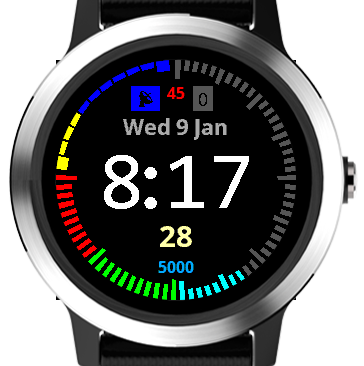

# garmin-simple-clarity
A simple clutter-free watchface for Garmin 240x240 round smartwatches.

## Legend
* _Lower Left_: Battery percentage
* _Upper Left_: Stairs climbed
* _Right_: Steps walked
* _Top_: Phone connectivity (left), Calories burned (center), and Notification count (right).
* _Middle_: Day, Month, Time, Seconds (updates every second)
* _Bottom_: Daily step goal

## Supported Devices
* Approach S60
* D2 Charlie
* D2 Delta / Delta PX / Delta S 
* Descent Mk1
* Fēnix 5/5 Plus/5S Plus/5X/5X Plus
* Forerunner 645 / 645 Music
* Forerunner 935
* quatix 5
* tactix Charlie
* Vívoactive 31 / 3 Music

1. This application is optimized for the Vívoactive series.

## Device Screenshots
[Screenshots](./devices/DeviceScreenshots.md)
